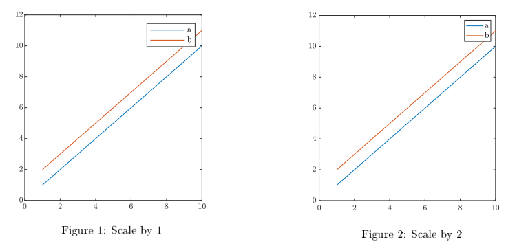

# prepareFig
This can be used to beautify plots for publication in academic papers.

Concerning the scaling: I scale up by default as in my opinion, the legend boxes are too large. Take a look at

An explanation how the graphics were generated is available in ScalingVisualization.md.

Author: Florian Pfaff, pfaff@kit.edu
